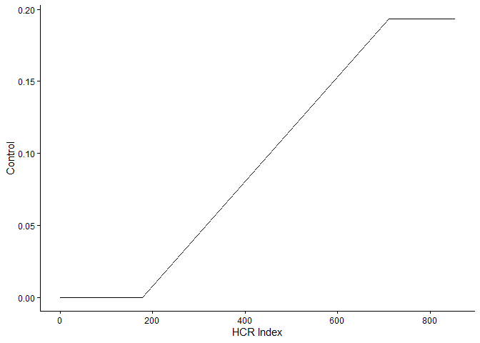
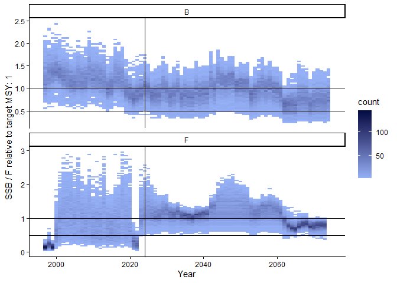
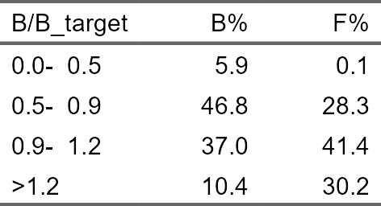
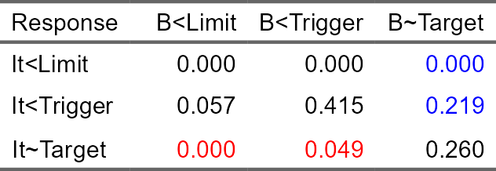
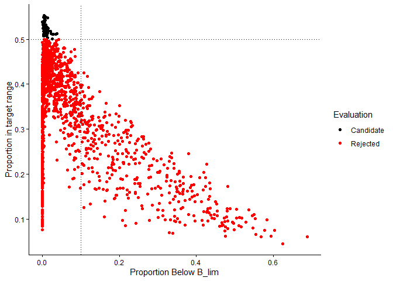
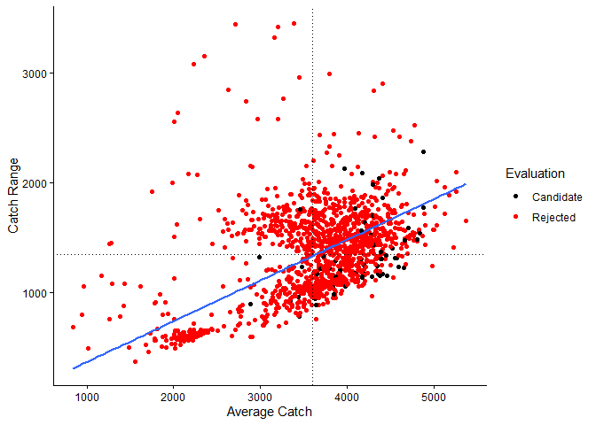
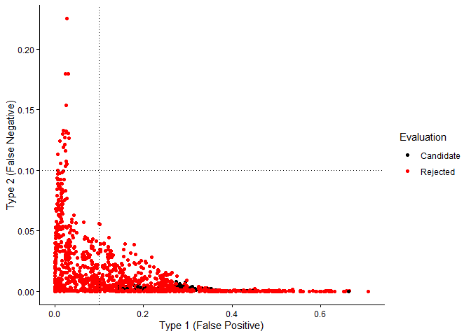
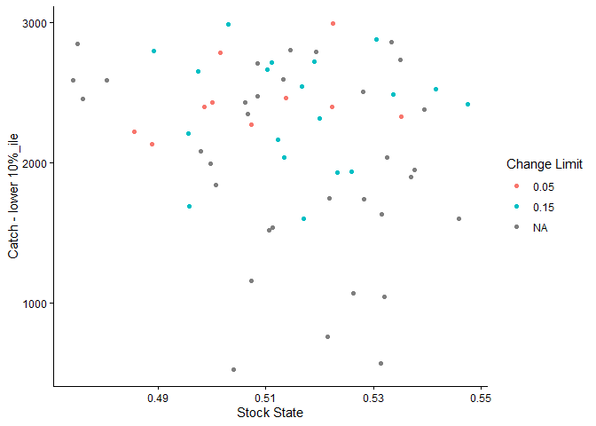
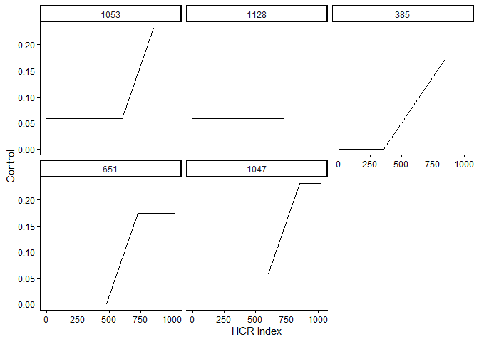
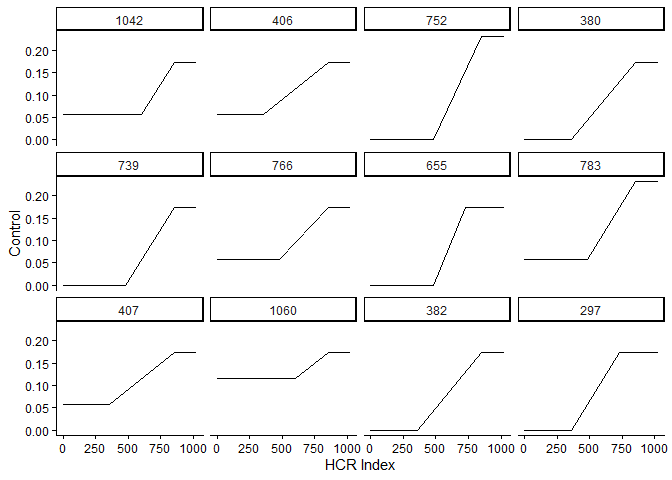

<!-- README.md is generated from README.Rmd. Please edit that file -->

# Bayesian Index Based Management Strategy Evaluations

This is an extension package for evaluating index-based harvest control
rules for stock assessment state space production model JABBA ((Winker
et al. 2018)), a Stan version of the JABBA model and a length-based
catch curve fishblicc (Medley 2025). The package allows testing of
index-based linear harvest control rules against projections of these
stock assessment models. This is a management strategy evaluation in
that the linear index-based HCR is simpler than the stock assessment
operating model, but clearly scenarios that can be tested are much more
limited than with software such as openMSE and FLR. The main advantage
is that these evaluations can be undertaken very rapidly as an extension
to the stock assessment and help incorporate uncertainty from the
assessment into the scientific advice to management.

This package is designed to identify index-based HCR that are consistent
with management objectives based on a series of plausible fits of the
stock assessment model.

Index-based means it treats the calculated index as an index of
abundance or mortality - the same assumption as in the stock assessment
models. For the production models, the CPUE is used to calculate an
index which then leads to adjustments in the control, either effort or
catch limits. For the length-based catch curve, mean length is used as a
proxy of fishing mortality. Controls such as closed areas or seasons
would need to be translated into effort or catch limits or changes in
selectivity to be applied in the simulations.

***WARNING: This software has not undergone much testing yet and so may
well have bugs. It seems to work…***

## Installation

You can install the current version of BIBCRE:

``` r
if (! require("remotes")) install.packages("remotes")
remotes::install_github("PaulAHMedley/BIBCRE")
```

The stock assessment software is not a requirement to run the
simulations, but clearly will be required to generate the model fits
that are then used in this software.

See <https://github.com/jabbamodel/JABBA> for installing and using
JABBA.

## Workflow

Typically, stock assessment evaluation using linear index-based harvest
control rules would follow:

1.  Generate one or more accepted stock assessment fits using the
    relevant package.

2.  Define the linear control rules, moving average parameter (ma),
    change_limit ranges to test and generate one or more HCR within a
    tibble

3.  Run all HCR to be tested on stock assessment fit projections,
    generating performance indicators for each HCR.

4.  Generate plots and tables of HCR performance. Identify HCR to be
    rejected if they do not meet status objectives.

5.  Find “best performing” HCR based on relative performance.

Steps 2-5 can be repeated with different defined HCR, for example fine
tuning HCR trigger points.

## Example

In this simple example, we look at alternative harvest control rules
(HCR) that might be applied. This is useful not only to identify HCR,
but also possible risk based reference points that might be used instead
of the median MSY reference point, for example.

The example data are taken from a small penaeid shrimp, seabob, caught
off the north coast of South America.

The model only supports controls on fishing of effort or catch. In this
case, we look at using effort.

We can run a quick test by creating a linear HCR that just applies a
fixed level of effort unless the index below the MSY point, when it
reduces effort down to zero at 25% of the MSY level (i.e. point when the
fishery closes). This is done by creating the HCR function based on the
JABBA model fit, then extracting the MSY median reference points from
the JABBA fit and use these reference points to define and run an HCR in
the JABBA projections.

``` r
library("BIBCRE")
ggplot2::theme_set(ggplot2::theme_classic())
HCR <- create_JABBA_MSE(jabba_seabob,
                       proj_length=50, 
                       nsim=1000)

ref_pt <- JABBA_MSY_refpt(jabba_seabob, ref_year=2022)
HCR_sim <- with(ref_pt, HCR(c(IMSY*0.25, IMSY), c(0, FMSY), control_type="Effort", change_limit=NA, ma=0.5))
```

The harvest control rule can be plotted.

``` r
with(ref_pt, graph_linear_HCR(tibble::tibble(ID=1, trIndex = list(c(IMSY*0.25, IMSY)), trControl=list(c(0, FMSY)), change_limit=NA, ma=0.5)))
```



An individual HCR simulation projection can be plotted.

``` r
graph_sim_Btar_Ftar(HCR_sim, type="both")
```



And the proportion of the simulation spent in each status range based on
the reference points.

``` r
table_sim_status(HCR_sim)
```



The HCR decision-making can be evaluated to some extent by checking
whether its responses are coordinated to changes in stock status. The
HCR can make two mistakes: not responding when the stock status falls
below the limit reference point (false negative) or conversely
responding when the stock is not below the limit reference point (false
positive). In general, the former is considered worse (coloured red in
the table), but the fewer mistakes (colour black) the better the HCR
should be performing.

``` r
table_sim_decision(HCR_sim)
```



Various performance indicators are recorded consisting of measures of
catch (average, range and lower percentile) and stock status (measures
related to the reference points) as well as decision performance. The
decision performance is not important except to examine whether trigger
points might be adjusted to improve the HCR.

Other performance indicators could be added in future (e.g. based on
catch rates), but most alternatives are strongly related to those
presented below and adding more performance indicators would not
necessarily clarify comparisons between HCR.

``` r
table_sim_performance(HCR_sim)
```


To test a range of HCRs, they can be defined in a data frame (tibble),
where each row defines an HCR to be tested. To do this, we define
reference points for the CPUE index and fishing mortality at MSY, then
relative range around these reference points to test, with the number of
inflexion points when the control changes in each HCR and the number
breaks between the ranges which defines where these inflexion points
occur and hence the number of HCR to be tested. Because this results in
the generation of HCR from all combinations of the supplied parameters,
some may be considered inappropriate or trivial. In this case, we remove
the HCR in which there is no fishing.

All these HCR are plotted on a single graph, so all alternative HCR can
be viewed. Each HCR can pass through any two nodes.

The control in this case is instantaneous fishing mortality (NOT the
JABBA harvest rate H which is catch divided by biomass). It is assumed
that fishing mortality is proportional to effort.

``` r
rel_index_range = c(0.5, 1.2)
rel_control_range = c(0.0, 1.2)
NInflex = 2
NBreaks = 5 
change_limit = c(NA, 0.05, 0.15)
ma = c(0.25, 0.5, 0.75)

TestHCR_df <- define_HCR_test_range(ref_pt$IMSY, ref_pt$FMSY, 
                         control_type = "Effort",
                         rel_index_range = c(0.5, 1.2),
                         rel_control_range = c(0.0, 1.2), 
                         NInflex = 2, 
                         NBreaks = 5, 
                         change_limit = c(NA, 0.05, 0.15), 
                         ma = c(0.25, 0.5, 0.75),
                         ctrl_pF = 1) |>
  dplyr::filter(purrr::map_lgl(trControl, ~ sum(.) > 0)) |> # remove the no fishing
  dplyr::mutate()

graph_linear_HCR(TestHCR_df)
```


In addition, we define three alternate limits of the control change from
year to year, and three alternate moving average smoothing parameters.

For the change limit, the maximum proportional change in the control
from year to year is defined which overrides the HCR if HCR implies a
higher proportional change. If this value is NA, no change limit is
applied.

The moving average parameter is a simple smoother on the index defining
the weight on the most recent observed CPUE value, so
$I_{t+1} = ma \ C/f + (ma - 1) I_t$. A value of 1.0 just uses the
current index with no smoothing, and a value of 0 means the index
remains constant and does not change. The most recent observation is
weight more heavily the closer `ma` is to 1.0.

Each alternative HCR can be plotted in terms of status and in terms of
catches, which represent the two main performance criteria. The
management objective is presumed to be to keep the stock around the MSY
level while maximising catches. The candidate HCR are identified on this
basis.

The exact definition is defined in the risk based reference points. So
the candidate must keep the stock “mostly” (\>50%) in the BMSY_range
with the probability of breaching the limit reference point below the
maximum risk. If this is not achieved the HCR is rejected. The
probability reference points are marked on the graph as dotted lines.
Adjusting the risk based reference varies the number of candidate HCR
and with highly uncertain assessment, all HCR being tested can be
rejected. In this case, a small number of the tested HCR achieve these
criteria.

``` r
graph_HCR_status(HCR_res, HCR)
```



The other measures of performance are related to catches. The average
catch and annual changes in catch are usually of interest. This is
measured in average catch achieved for the HCR and in the annual
variation measured as the average catch range. There are no reference
points for this: higher average catches are better and lower catch range
is better. The blue regression line shows the exchange between catch and
catch variation. HCR below the blue line have a better exchange
increasing the catch more relative to the increase in catch range.

``` r
graph_HCR_catches(HCR_res)
```



In reviewing the HCR, it is worth evaluating its decision-making to see
how it might be improved. The HCR can make two mistakes: not responding
when the stock status falls below the limit reference point (false
negative) or conversely responding when the stock is not below the limit
reference point (false positive). In general, the former is considered
worse, but the fewer mistakes the better the HCR should be performing.

``` r
graph_HCR_decision(HCR_res)
```



The lowest annual catch represented by the lower 10 percentile can be
checked in relation to the change limit. Annual change limits are often
used to prevent catches fluctuating too much but can cause a drop in
stock status. In these simulations, some HCR result in zero catches in
some years which would potentially be unacceptable and a change limit
would help prevent this.

``` r
CandidateHCR_df <- HCR_res |>
  dplyr::filter(Evaluation=="Candidate")
graph_HCR_status_catches(CandidateHCR_df)
```



HCRs can be subset and plotted. For example, the top 5 HCRs with respect
to status performance (proportion of the time in the target minus the
proportion of the time below the limit reference point). Each HCR has an
integer, so can be inspected individually within the simulation table.

``` r
CandidateHCR_df |>
  dplyr::arrange(dplyr::desc(State)) |>
  head(n=5) |>
  graph_linear_HCR(HCR_ID=TRUE)
```



Or the twelve highest ranking linear HCRs can be plotted. Rank is based
on performance in relation to stock status and catch.

``` r
BestHCR <- CandidateHCR_df |>
  dplyr::arrange(Rank) |>
  head(12)
graph_linear_HCR(BestHCR, HCR_ID=TRUE)
```



The performance indicators for these “best” HCR can be presented in a
table.

``` r
table_HCR_performance(BestHCR)
```


## Reference

<div id="refs" class="references csl-bib-body hanging-indent">

<div id="ref-medley2025" class="csl-entry">

Medley, Paul A H. 2025. “A New Bayesian Catch Curve Stock Assessment
Model for the Analysis of Length Data from Multi-Gear Fisheries.” *ICES
Journal of Marine Science* 82 (12): fsaf224.
<https://doi.org/10.1093/icesjms/fsaf224>.

</div>

<div id="ref-winker2018" class="csl-entry">

Winker, Henning, Felipe Carvalho, and Maia Kapur. 2018. “JABBA: Just
Another Bayesian Biomass Assessment.” *Fisheries Research* 204 (August):
275288. <https://doi.org/10.1016/j.fishres.2018.03.010>.

</div>

</div>
